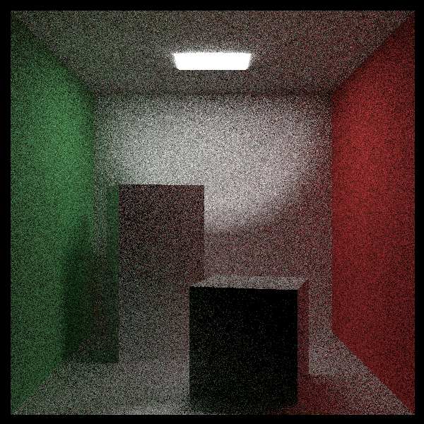

# Path Tracer in C++

This project is a physically-based path tracer written in C++. It is highly configurable, supporting a wide range of parameters, materials, and lighting techniques.

Below is an overview of its features and functionality.

## Features

### Rendering

The path tracer renders images in **High Dynamic Range (HDR)**, producing vibrant and realistic visuals. You can configure various rendering parameters to customize the output:

- **Resolution**: Define the size of the output image in pixels
- **Samples per Pixel**: Specify the number of rays cast per pixel. Stratified sampling ensures even distribution of rays across the pixel grid
- **Background**: Set a solid color for the background or use a skybox by projecting the rays onto a texture
- **Maximum Bounces**: Control the number of times a ray can bounce off surfaces before being terminated
- **Tone Mapping**: Choose from multiple algorithms to compress HDR colors into displayable ranges:
    - None (value clamped between 0 and 1)
    - Reinhard tone mapping
    - Exposure tone mapping
- **Gamma Correction**: Ensure accurate color representation by correcting for display gamma

The rendered output is saved as a `.ppm` image file.

### Optimization with BVH

To speed up ray tracing, the path tracer employs a **Bounding Volume Hierarchy (BVH)**. A bounding box is created around each object in the scene, with a small margin to ensure proper coverage. This hierarchy reduces the number of intersection tests required, significantly improving performance for complex scenes.

### Camera

The camera is highly flexible, allowing you to control its parameters for a variety of effects:

- **Position**: Place the camera on a specific point in the scene
- **Orientation**: Point the camera in a specific direction or target a particular point in the scene
- **Field of View** or **Focal Distance/Sensor width**: Choose between setting the horizontal field of view or defining the sensor size and focal distance
- **Depth of Field**: Simulate focus blur by adjusting the aperture size and focus distance

### Supported Objects

The path tracer supports several 2D and 3D objects for building scenes:

- **2D Shapes**:
    - Triangle: Defined by three points in the scene
    - Quad: Defined by its center, width vector, and height vector (in 3 dimensions)
    - Ellipse: Defined by its center and radii (major and minor axes)
    - Ring: Defined by its center and two radii (inner and outer)
- **3D Shapes**:
    - Sphere: Defined by its center and radius
    - Box: Defined by its center and dimensions, consisting of six quads

### Lighting

The path tracer currently supports only point light sources, but materials can also emit light.

- **Point Light**: A small light source defined by its position, color, intensity, and radius. Its intensity decreases with distance based on attenuation

### Textures

The path tracer supports image-based and constant values textures, enabling detailed and varied surface appearances:

- **Uniform Textures**: A single value (vector or float) can be defined as a texture, effectively creating a 1x1 image
- **Image-based textures**: Images can be loaded onto textures using `stb_image`, ensuring compatibility with standard image formats
- **Texture Management**: Textures are managed by a `TextureManager`, which ensures each texture has a unique name for easy access and reuse
- **Texture Mapping**:
    - Wrapping methods:
        - *Repeat*: The texture is repeated indefinitely in both the horizontal and vertical directions creating a seamless tiling effect
        - *Mirror Repeat*: Similar to *Repeat*, but the texture is flipped horizontally or vertically every time it repeats
        - *Clamp*: The texture coordinates are clamped to the range [0, 1]. If the texture coordinates go beyond this range, the texture sample is taken from the closest edge
        - *Clamp to Color*: Instead of sampling from the texture's edge, any texture coordinates outside the range [0, 1] return a specific constant color value defined
    - Filtering methods:
        - *Nearest neighbor*: Selects the texture texel closest to the given texture coordinates.
        - *Bilinear interpolation*: Interpolates between the nearest four texels depending on their distance
- **Color Spaces**: Choose between `sRGB` and linear `RGB` for accurate color calculations in rendering when using color textures

### Materials

The `MaterialManager` manages the materials by associating each material with a unique name. For each material's parameters, textures can be added either as constant values (creating a specific texture for this material) or by referencing a texture name from the `TextureManager`.

### Material Properties:

- **Diffuse Color**: The material’s diffuse color affects how rays that intersect the material are attenuated by this color
- **Metalness**: Determines whether the material behaves as metallic. Metallic materials reflect light in the direction of the normal, while non-metallic materials scatter light in all directions
- **Roughness**: Defines the microfacets of the surface, affecting the sharpness of reflections
- **Normal Map**: Adjusts the surface normal based on the texture, affecting how the surface interacts with light in tangent space
- **Opacity**: Represents the material’s ability to refract light, influenced by the Index of Refraction (IOR)
- **IOR (Index of Refraction)**: Defines the material’s IOR, affecting how light refracts when it passes through the material, typically used for transparent or semi-transparent materials
- **Emission Color**: If not defined, the emission color defaults to the diffuse color. When defined, it specifies the material's emission color, simulating light emitted by the material
- **Emission Strength**: Defines the intensity of the emitted light, adding light emission to the scene, potentially contributing to global illumination

### Rays

A ray is defined by:

- **Origin and Direction**: The starting point and trajectory of the ray.
- **Intersection Data**: When a ray intersects an object, it stores:
    - Whether the ray hit an object or not
    - The intersection point
    - The surface normal at the intersection
    - The material of the intersected object
    - Texture coordinates (u, v) for proper texture sampling
    - The traveled distance, to ensure the closest intersection is used
    - The color and intensity of the light if the ray hits a light source
    - The IOR of the environment of the ray
 

## Future Improvements

- **Noise Reduction**: Implement denoising techniques such as:
  - **Importance Sampling**: Improve convergence by better sampling light sources
  - **Russian Roulette Termination**: Reduce unnecessary bounces for efficiency
- **Advanced Rendering Features**:
  - **Bidirectional Path Tracing**: Improve light transport efficiency, especially for complex indirect lighting
  - **Metropolis Light Transport (MLT)**: Optimize light sampling for challenging scenarios
  - **Spectral Rendering**: Simulate wavelength-dependent effects such as dispersion
  - **Volumetric Rendering**: Support participating media for fog, smoke, and subsurface scattering
- **Add Animation Support**: Implement features such as:
  - **Moving Objects**: Support transformations over time
  - **Motion Blur**: Introduce shutter speed simulation for realistic blur effects
- **Add support for different light types**: Extend the lighting system to include various light types such as area lights, spotlights, and directional lights
- **Add support for 3D models (OBJ files)**: Implement functionality to load and render 3D models from OBJ files
 
## License

This project is licensed under the MIT License - see the `LICENSE` file for details.
